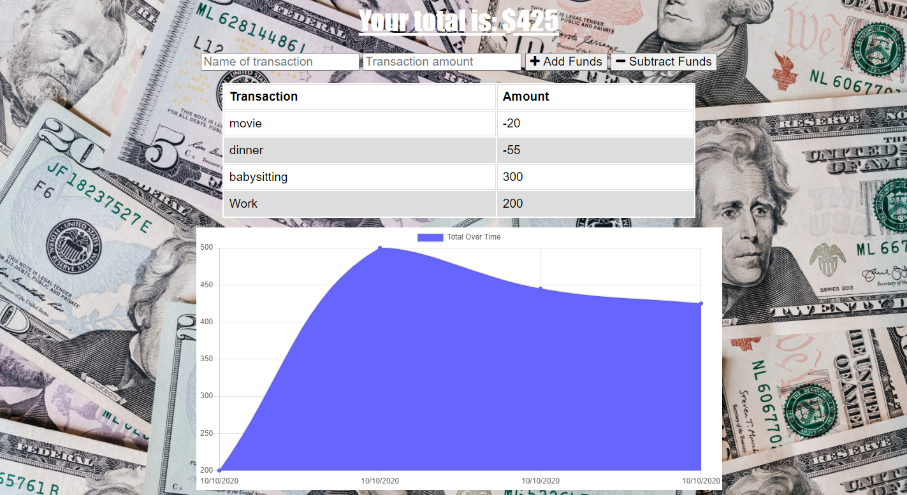
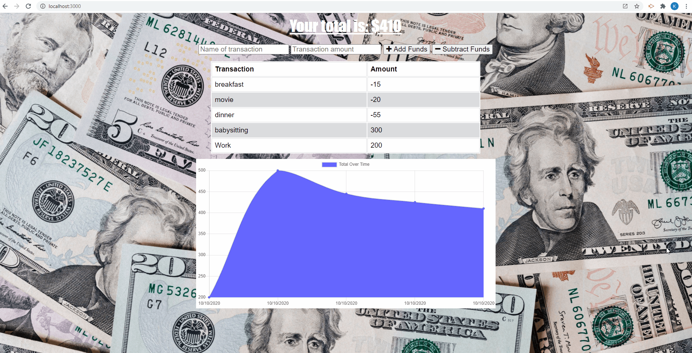

# budget-tracker [](https://opensource.org/licenses/MIT)

## Links 
- Deployed Application: https://intense-reef-26907.herokuapp.com/

##Table of Contents
* [User Story](#user-story)
* [Business Context](#business-context)
* [How Budget Tracker Works](#how-budget-tracker-works)
* [Installation](#installation)
* [Webpage Screenshots](#webpage-screenshots)
* [Questions](#Questions)

## User Story
```
AS AN avid traveller
I WANT to be able to track my withdrawals and deposits with or without a data/internet connection
SO THAT my account balance is accurate when I am traveling
```

## Business Context

Giving users a fast and easy way to track their money is important, but allowing them to access that information anytime is even more important. Having offline functionality is paramount to our applications success.

## How Budget Tracker Works
Budget Tracker is an application that allows users to track their withdrawals and deposits with or without a data/internet connection. The service-worker.js file includes functions that allow the user to save their data in a "cache". By using a mongoose connection, Budget Tracker allows the user to save data and see the same saved data whether they are using their web browser or their installed Budget Tracker application, which achieves the goal of offline functionality. 

## Installation
Budget Tracker is able to be used three different ways:
First way is to clone this repository and run an npm install or yarn add in your terminal, then run the server and use Budget Tracker on your local server. 
Second way is to click the link to the deployed application and use it in your web browser.
Third way is to navigate to the right side of the local server or deployed application URL and click the plus sign, then install Budget Tracker and use it without internet connection. 

## Webpage Screenshots



## Questions 
If you have any questions about Budget Tracker, feel free to email me at: ktlnn.nguyen@gmail.com
